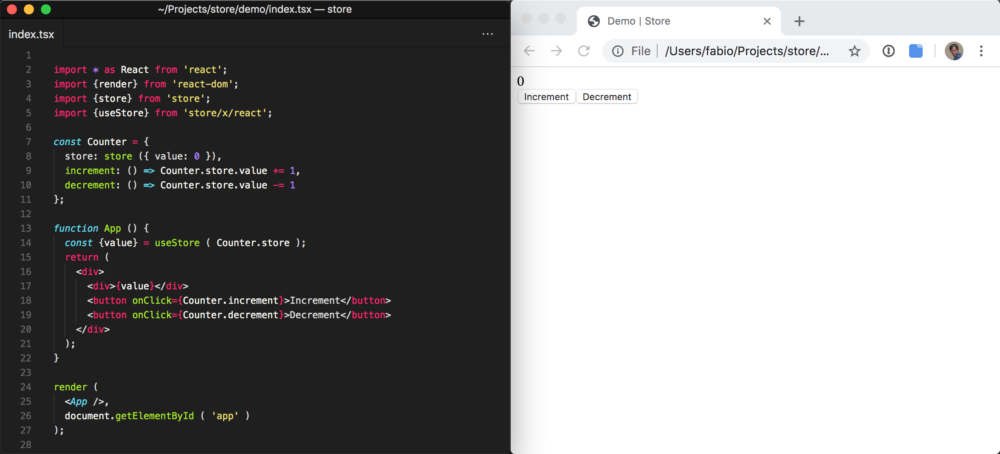
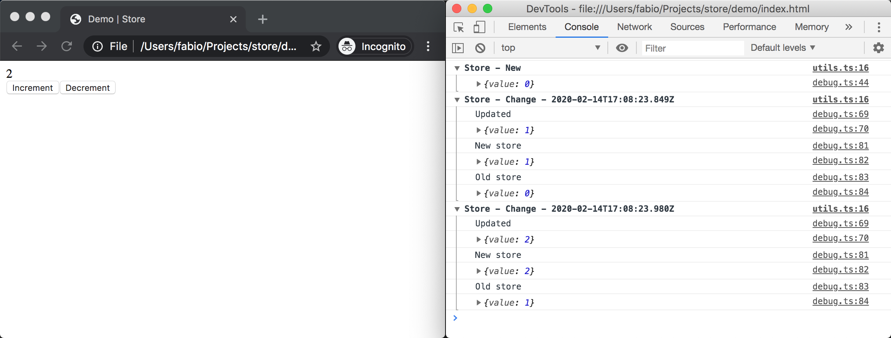

# Store

A beautifully-simple framework-agnostic modern state management library.



## Features

- **Simple**: there's barely anything to learn and no boilerplate code required. Thanks to our usage of [`Proxy`](https://developer.mozilla.org/en-US/docs/Web/JavaScript/Reference/Global_Objects/Proxy)s you just have to wrap your state with [`store`](#store), mutate it and retrieve values from it just like if it was a regular object, and listen to changes via [`onChange`](#onchange) or [`useStore`](#usestore).
- **Framework-agnostic**: Store doesn't make any assuptions about your UI framework of choice, in fact it can also be used without one.
- **React support**: an hook for React is provided, because that's the UI framework I'm using. Support for other UI frameworks can be added easily, PRs are very welcome.
- **TypeScript-ready**: Store is written in TypeScript and enables you to get a fully typed app with no extra effort.

Read more about how Store compares against other libraries in the [FAQ](#faq) section below.

## Install

```sh
npm install --save store@npm:@fabiospampinato/store
```

## Usage

- Core
  - [`store`](#store)
  - [`onChange`](#onchange)
  - [`debug`](#debug)
  - [`Hooks`](#hooks)
- Extra/React
  - [`useStore`](#usestore)

### Core

#### `store`

The first step is wrapping the objects containing the state of your app with the `store` function, this way Store will be able to transparently detect when mutations occur.

Example usage:

```ts
import {store} from 'store';

const CounterApp = {
  store: store ({ value: 0 }),
  increment: () => CounterApp.store.value += 1,
  decrement: () => CounterApp.store.value -= 1
};
```

- ℹ️ The object passed to `store` can contain [primitives](https://developer.mozilla.org/en-US/docs/Glossary/Primitive), [functions](https://developer.mozilla.org/en-US/docs/Web/JavaScript/Guide/Functions), [getters](https://developer.mozilla.org/en-US/docs/Web/JavaScript/Reference/Functions/get), [setters](https://developer.mozilla.org/en-US/docs/Web/JavaScript/Reference/Functions/set), [Dates](https://developer.mozilla.org/en-US/docs/Web/JavaScript/Reference/Global_Objects/Date), [RegExps](https://developer.mozilla.org/en-US/docs/Web/JavaScript/Reference/Global_Objects/RegExp), [Objects](https://developer.mozilla.org/en-US/docs/Web/JavaScript/Reference/Global_Objects/Object), [Arrays](https://developer.mozilla.org/en-US/docs/Web/JavaScript/Reference/Global_Objects/Array), [ArrayBuffers](https://developer.mozilla.org/en-US/docs/Web/JavaScript/Reference/Global_Objects/ArrayBuffer), [TypedArrays](https://developer.mozilla.org/en-US/docs/Web/JavaScript/Reference/Global_Objects/TypedArray), [Maps](https://developer.mozilla.org/en-US/docs/Web/JavaScript/Reference/Global_Objects/Map) and [Sets](https://developer.mozilla.org/en-US/docs/Web/JavaScript/Reference/Global_Objects/Set).
- ℹ️ `store` will wrap your object with a [`Proxy`](https://developer.mozilla.org/en/docs/Web/JavaScript/Reference/Global_Objects/Proxy), which will detect mutations, and return a proxied object.
- ℹ️ Never mutate the raw object passed to `store` directly, as those mutations won't be detected, always go through the proxied object returned by `store` instead. I'd suggest you to wrap your raw objects with `store` immediately so you won't even keep a reference to them.
- ℹ️ In order to trigger a change simply mutate the proxied object returned by `store` as if it was a regular object.
- ℹ️ Mutations happening at locations that need to be reached via a [Symbol](https://developer.mozilla.org/en-US/docs/Web/JavaScript/Reference/Global_Objects/Symbol) aren't detected (e.g. `{ [Symbol ()]: { undetected: true }`).

#### `onChange`

Next you'll probably want to listen for changes to your stores, the `onChange` function is how you do that in a framework-agnostic way.

This is its interface:

```ts
// No selector, listen to all changes
function onChange ( store: Store, listener: ( data: Store ) => any ): Disposer;
// With selector, listen to only changes that cause the value returned by the selector to change
function onChange ( store: Store, selector: ( store: Store ) => Data, listener: ( data: Data ) => any ): Disposer;
```

- The `store` argument is a proxied object retuned by the [`store`](#store) function.
- The `listener` argument is the function that will be called when a change to the store occurs. It will be called with the value returned by the `selector`, if a selector was provided, or with the entire store otherwise.
- The `selector` optional argument is a function that computes some value that will be passed to the listener as its first argument. It's called with the store as its first argument.
- The return value is a disposer, a function that when called will terminate this specific listening operation.

Example usage:

```ts
import {store, onChange} from 'store';

const CounterApp = {
  store: store ({ value: 0 }),
  increment: () => CounterApp.store.value += 1,
  decrement: () => CounterApp.store.value -= 1
};

// No selector

const disposer1 = onChange ( CounterApp.store, store => {
  console.log ( 'Value changed, new value:', store.value );
  disposer1 (); // Preventing this listener to be called again
});

// With selector

const disposer2 = onChange ( CounterApp.store, store => store.value % 2 === 0, isEven => {
  console.log ( 'Is the new value even?', isEven );
});

CounterApp.increment (); // This will cause a mutation, causing the listeners to be called
CounterApp.increment (); // This will cause another mutation, but the listeners will still be called once as these mutations are occurring in a single event loop tick

setTimeout ( CounterApp.increment, 100 ); // This will cause the remaining listener to be called again
```

- ℹ️ Using a selector that retrieves only parts of the store will improve performance.
- ℹ️ It's possible that the listener will be called even if the object returned by the selector, or the entire store, didn't actually change.
- ℹ️ Calls to `listener`s are automatically coalesced and batched together for performance, so if you synchronously, i.e. within a single event loop tick, mutate a store multiple times and there's a listener listening for those changes that listener will only be called once.

#### `debug`

`debug` provides a simple way to access your stores and see at a glance how and when they change from the DevTools.



This is its interface:

```ts
type Global = {
  stores: Store[], // Access all stores
  log: () => void // Log all stores
};

type Options = {
  collapsed: true, // Whether the logged groups should be collapsed
  logStoresNew: false, // Whether to log new store that have been created
  logChangesDiff: true, // Whether to log diffs (added, updated, removed) state changes
  logChangesFull: false // Whether to log the previous and current state in their entirity
};

function debug ( options?: Options ): Global;
```

Example usage:

```ts
import {debug} from 'store';

debug ();
```

Once called, `debug` defines a global object named `STORE`, which you can then access from the DevTools, and returns it.

Example usage:

```ts
STORE.stores[0].value += 1; // Manually triggering a mutation
STORE.log (); // Logging all stores to the console
```

- ℹ️ It's important to call `debug` before creating any stores.
- ℹ️ It's important to call `debug` only during development, as it may perform some potentially slow computations.

#### `Hooks`

`Hooks` provides a simple way to "hook" into Store's internal events.

Each hook has the following interface:

```ts
class Hook {
  subscribe ( listener: Function ): Disposer
}
```

- `subscribe` registers a function for being called every time that hook is triggered.
  - The returned value is a disposer, a function that when called will terminate this specific subscription.

These are all the currently available hooks:

```ts
const Hooks = {
  store: {
    change: Hook, // Triggered whenever a store is mutated
    new: Hook // Triggered whenever a new store is created. This hook is used internally for implementing `debug`
  }
};
```

Example usage:

```ts
import {Hooks} from 'store';

const disposer = Hooks.store.new.subscribe ( store => {
  console.log ( 'New store:', store );
});

disposer ();
```

If you need some more hooks for your Store plugin let me know and I'll make sure to add them.

We currently don't have an official "Store DevTools Extension", but it would be super cool to have one. Perhaps it could provide a GUI for [`debug`](#debug)'s functionalities, and/or implement other features like time-travel debugging. If you're interesting in developing this please do get in touch! 😃

### Extra/React

These extra features, intended to be used with React, are available from a dedicated subpackage.

#### `useStore`

`useStore` is a React [hook](https://reactjs.org/docs/hooks-intro.html) for accessing a store's values from within a functional component in a way that makes the component re-render whenever those values change.

This is its interface:

```ts
// No selector, re-render after any change
function useStore ( store: Store ): Store;
// With selector, re-render only after changes that cause the value returned by the selector to change
function useStore ( store: Store, selector: ( store: Store ) => Data, dependencies: ReadonlyArray<any> = [] ): Data;
```

- The `store` argument is a proxied object retuned by the [`store`](#store) function.
- The `selector` optional argument if a function that computes some value that will be the return value of the hook. It's called with the store as its first argument.
- The `dependencies` optional argument is an array of dependencies used to inform React about any objects your selector function will reference from outside of its innermost scope, ensuring the selector gets called again if any of those change.
- The return value is whatever `selector` returns, if a selector was provided, or the entire store otherwise.

Example usage:

```tsx
import {store, onChange} from 'store';
import {useStore} from 'store/x/react';

const CounterApp = {
  store: store ({ value: 0 }),
  increment: () => CounterApp.store.value += 1,
  decrement: () => CounterApp.store.value -= 1
};

// No selector

const CounterComponent1 = () => {
  const {value} = useStore ( ConunterApp.store );
  return (
    <div>
      <div>{value}</div>
      <button onClick={CounterApp.increment}>Increment</button>
      <button onClick={CounterApp.decrement}>Decrement</button>
    </div>
  )
};

// With selector

const CounterComponent2 = () => {
  const isEven = useStore ( ConunterApp.store, store => store.value % 2 === 0 );
  return (
    <div>
      <div>Is the value even? {isEven}</div>
      <button onClick={CounterApp.increment}>Increment</button>
      <button onClick={CounterApp.decrement}>Decrement</button>
    </div>
  )
};
```

- ℹ️ You basically just need to wrap the parts of your component that access any value from any store in a `useStore` hook, in order to make the component re-render whenever any of the retireved values change.
- ℹ️ You don't need to use `useStore` for accessing methods that mutate the store, you can just reference them directly.
- ℹ️ Using a selector that retrieves only parts of the store will improve performance.
- ℹ️ It's possible that the component will be re-rendered even if the object returned by the selector, or the entire store, didn't actually change.
- ℹ️ Re-renders are automatically coalesced and batched together for performance, so if synchronously, i.e. within a single event loop tick, the stores you're listening to are mutated multiple times the related components will only be re-rendered once.

## FAQ

### Why not using [Redux](https://github.com/reduxjs/redux), [Unstated](https://github.com/jamiebuilds/unstated), [Overstated](https://github.com/fabiospampinato/overstated), [react-easy-state](https://github.com/RisingStack/react-easy-state) etc.?

I'll personally use this library over more popular ones for a few reasons:

- **Simpler APIs**: almost all other state management libraries I've encountered have APIs that don't resonate with me, often they feel unnecessarily bloated. I don't want to write "actions", I don't want to write "reducers", I don't want to litter my code with decorators or unnecessary boilerplate.
- **Fewer footguns**: many other libraries I've encountered have multiple footguns to be aware of, some which may cause hard-to-debug bugs. With Store you won't update your stores incorrectly once you have wrapped them with [`store`](#store), you won't have to deal with asynchronous updates, and you won't have to carefully update your stores in an immutable fashion.
- **Fewer restrictions**: most other libraries require you to structure your stores in a specific way, update them with library-specific APIs, perhaps require the usage of classes, and/or are tied to a specific UI framework. Store is more flexible in this regard: your stores are just proxied objects, you can manipulate them however you like, adopt a more functional coding style if you prefer, and the library isn't tied to any specific UI framework, in fact you can use it to manage your purely server-side state too.
- **Easy type-safety**: some libraries don't play very well with TypeScript and/or require you to manually write some types, Store just works with no extra effort.

### Why not using Store?

You might not want to use Store if: the design choices I made don't resonate with you, you need something more battle-tested, you need to support platforms where [`Proxy` isn't available](https://caniuse.com/#search=proxy), or you need the absolute maximum performance from your state management library since you know that will be your bottleneck.

## License

MIT © Fabio Spampinato
